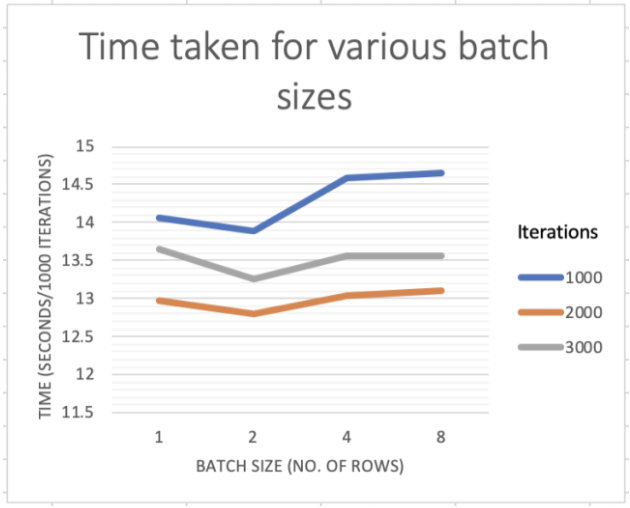
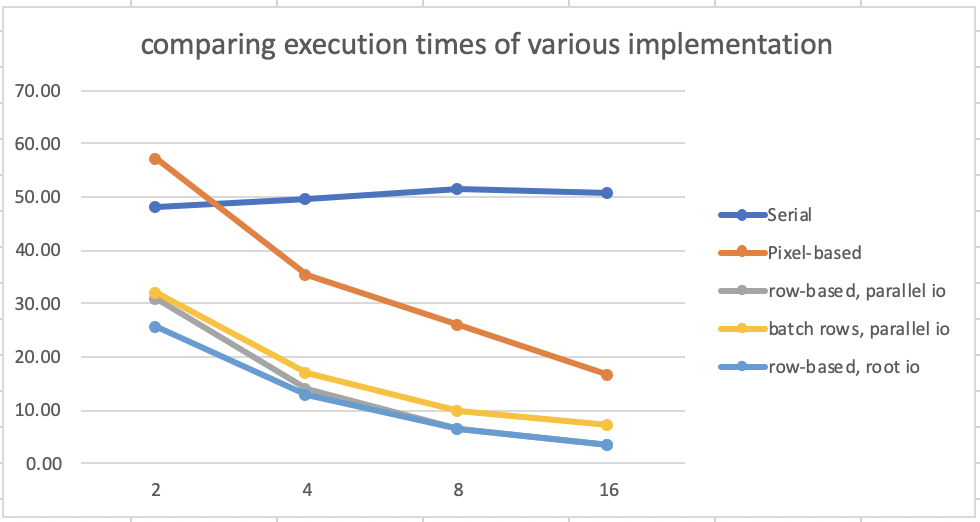

# fit3143-presentation

## pixel-based
each processor calculates RGB values for each pixel and writes the value at appropriate offset in the PPM file

```diff
root node
# start measuring the time and print init messages
+ MPI_File_open(MPI_COMM_WORLD, filename, MPI_MODE_RDWR | MPI_MODE_CREATE, MPI_INFO_NULL, &fp);
+ headerSize = sprintf(header, "P6\n %s\n %d\n %d\n %d\n", comment, iXmax, iYmax, MaxColorComponentValue);
+ MPI_File_write(fp, header, headerSize, MPI_CHAR, MPI_STATUS_IGNORE);

we wait for root to finish writing the header and broadcast
+ MPI_Barrier(MPI_COMM_WORLD);
+ MPI_Bcast(&headerSize, 1, MPI_INT, 0, MPI_COMM_WORLD);

# looping through each pixel

in the inner most loop, after computing RGB value for each pixel
+ MPI_File_write_at(fp, headerSize + (iY*iXmax + iX)*3, color, 3, MPI_CHAR, MPI_STATUS_IGNORE);

# after writing the image file

+ MPI_Barrier(MPI_COMM_WORLD);
+ MPI_File_close(&fp);

root
# start measuring the time and print completion messages
```


## row-based
three variations of row-based partition


### one row, parallel io
```diff
init
+ char row[charsInRow];

# looping through each row

+ rowOffset = iX*3;
+ row[rowOffset+0] = color[0];
+ row[rowOffset+1] = color[1];
+ row[rowOffset+2] = color[2];


in the outer loop, after computing RGB value all the pixels in each row
+ MPI_File_write_at(fp, headerSize + charsInRow*iY, row, sizeof(row), MPI_CHAR, MPI_STATUS_IGNORE);
```


### batch of rows, parallel io

```diff
init
+ char row[charsInRow*rowBatchSize];

# looping through batch of rows

+ rowOffset = batchNumber*charsInRow + iX*3;
+ row[rowOffset+0] = color[0];
+ row[rowOffset+1] = color[1];
+ row[rowOffset+2] = color[2];

in the outer loop, after computing RGB value all the pixels in all the rows in the specified batch
+ MPI_File_write_at(fp, headerSize + charsInRow*iY, row, sizeof(row), MPI_CHAR, MPI_STATUS_IGNORE);
```
</br>



### one row, root manages io
```diff
init
+ char *buffer;
+ char row[charsInRow];


# looping through batch of rows

+ rowOffset = batchNumber*charsInRow + iX*3;
+ row[rowOffset+0] = color[0];
+ row[rowOffset+1] = color[1];
+ row[rowOffset+2] = color[2];

in the outer loop, after computing RGB value all the pixels in each row
+ MPI_Gather(row, charsInRow, MPI_CHAR, buffer, charsInRow, MPI_CHAR, root, MPI_COMM_WORLD);
+ if (rank == root) fwrite(buffer, 1, charsInRow*nproc, fp);
```


## conclusion

